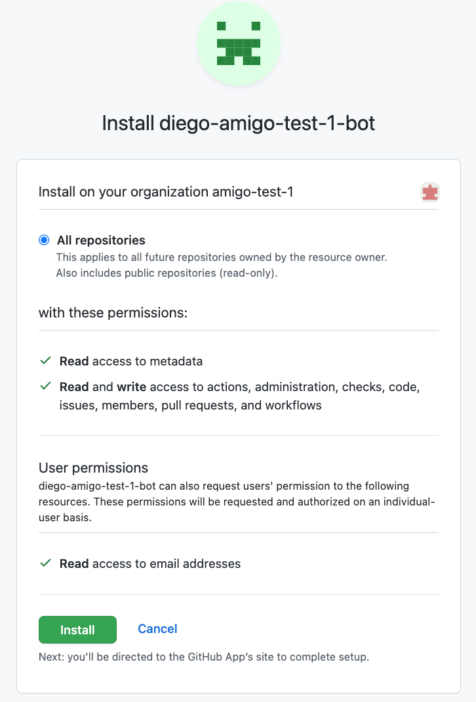
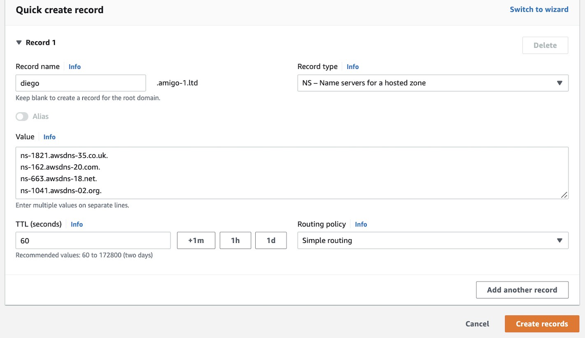

# Deployment Assets

## Deployment Process

Diego is a collaborating set of components running within your EKS cluster in your AWS account. It is also installed as a GitHub App so that it can create and manage repositories in your GitHub organisation. To simplify deployment the process is managed using the Diego CLI.

Once the [prerequisites](../deployment-guide/introduction.md) are in place, you run a series of CLI commands one after the other. Each command will prompt you for input information related to your AWS account, your EKS setup and your GitHub organization. 

> **Successfully completing each deployment step in the order described below is required for a complete and functional deployment of Diego.**

### Diego CLI
The Diego CLI contains it's own documentation. This can be accessed for any command by using the `--help` flag or using the `help` subcommand.

For example, running the following command:

```
diego help
```
returns:
```
The Diego Cloud CLI

 The loading order for the diego config file follows these rules:
 1.  If the --config flag is set, then only that file is loaded. The flag may only be set once.
 2.  If $DIEGOCONFIG environment variable is set, then it is used.
 3.  Otherwise,  is used

Usage:
  diego [command]

Available Commands:
  completion  Generate the autocompletion script for the specified shell
  help        Help about any command
  init        Manages the initialization of diego profiles
  install     Manages the installation of diego tools
  set-profile Set the given profile as default in the diego config file
  setup       Manages the setup of diego

Flags:
      --config string    Config file (default "/Users/roddyherries/.diego/config")
  -h, --help             help for diego
      --profile string   Profile name (default "default")

Use "diego [command] --help" for more information about a command.
```

### Command 1 - Install GitHub app

This command installs the Diego GitHub app in your organisation.

> Estimated time to complete this step: 1 minute ⏱️ 

1. Run the following command at your terminal:

    ```sh
    diego init github
    ```
2. Follow the CLI prompts to input your:
    - GitHub organisation name
    - domain name

3. Your browser will open and prompt you for permission to install the Diego GitHub application into your organisation. Review the permissions you are delegating to Diego and then click "Install" to continue.

    
 
4. After successful installation of the GitHub app you will be asked to return to the terminal where you should see confirmation that this step of the deployment is complete.

 ```
 Diego profile 'your github org name' configured successfully
 ```

#### Checks
- Navigate to your GitHub organisation and confirm the Diego App has been installed.

### Command 2 - Configure the CLI

This command configures the CLI with information about your AWS account and EKS installation.

> Estimated time to complete this step: 2 minute ⏱️ 

1. Run the following command at your terminal:

    ```
    diego init aws
    ```
2. Follow the CLI prompts to input your:
    - AWS account ID
    - AWS region that your EKS is installed in
    - AWS EKS cluster name
    - AWS EKS Cluster OIDC Provider URL
        - The URL can be obtained from your AWS Console under OpenID Connect provider URL under the Overview for your EKS cluster
        - e.g. `https://oidc.eks.eu-west-2.amazonaws.com/id/<32 character alphanumeric string>`

This updates your Diego CLI configuration file `$HOME/.diego/config` with information required for future CLI steps.

### Command 3 - Create tooling and project repositories

This command creates two new repositories in your GitHub organisation.

> Estimated time to complete this step: 1 minute ⏱️

1. Run the following command at your terminal:

    ```
    diego setup github
    ```

    This creates two repositories in your GitHub organisation:

    | Repo | Purpose |
    |---|---|
    | diego-default-project | Provides basic configuration for Argo CD project which would would list your onboarded applications and environments. |
    | diego-tooling | Provides an AWS cloud formation stack for provisioning aws resources and also references helm charts for open source tooling to be provisioned in the cluster as part of Diego Core. | 

2. The command should complete successfully with the following output:

    ```
    Repository https://github.com/rethread-co/diego-tooling created.
    Repository https://github.com/rethread-co/diego-default-project created.
    ```

#### Checks
- `diego-default-project` and `diego-tooling` are setup in your Github Organisation repository. <br/>
- In `diego-default-project` your organisations domain appears in the `applications` folder files and your organisation's name appears in the `root` folder files. <br/>
- In `diego-tooling` your organisations domain and name, as well as your cluster name and AWS account id should have populated across files in the diego-core folder. Please note `R53_ZONE_ID` is updated in a subsequent CLI step. <br/>

### Command 4 - Install Diego CloudFormation stack and set up domain delegation

> Estimated time to complete this step: 10 minutes ⏱️

1. Prerequisite

    This command uses the AWS SDK to invoke AWS CloudFormation. Appropriate AWS user or role credentials have to be set in the shell environment that the CLI command runs in.

    :::caution
    Diego installation does not require the use of root privileges. Do not use root privileges to perform the installation. See [IAM documentation](https://docs.aws.amazon.com/IAM/latest/UserGuide/id_root-user.html) for advice on how to use IAM safely without using your root user account. 
    :::

2. Run the following command at your terminal:

    ```
    diego setup aws
    ```

    This starts the installation of the Diego CloudFormation stack in the AWS account you specified earlier.  
    
    Part of this stack creates a new sub-domain of your organisation's domain. Diego components and your Diego managed applications will be hosted in this new sub-domain.

2. Wait until the CLI prompts you to create a new NS record in your orgnisation's DNS host file. This new record will delegate DNS requests to the new sub-domain name servers. The CLI will wait until you have performed this external step. Example output of the CLI:

    ```
    Creating cloudformation stack diego-stack .....

    Please add following NS records where diego.<yourdomain> is managed
    ns-1833.awsdns-33.co.uk.
    ns-55.awsdns-09.net.
    ns-149.awsdns-54.org.
    ns-2824.awsdns-35.com.
    ```

3. Using the domain manager tool for you organisation's domain, create a new NS record with the values shown in the CLI output. 

    For example, if your organisation's domain was managed in AWS Route53 then creating a new NS record looks like this:

        

### Command 5 - Deploy Diego in AWS EKS

This command deploys and starts all Diego components in your EKS cluster.

> Estimated time to complete this step: 50 minutes ⏱️

1. Prerequisite

    This command uses your locally installed `kubectl` to invoke  AWS EKS. AWS user or role credentials have to be set in the context this CLI command runs in.

    :::caution
    Diego installation does not require the use of root privileges. Do not use root privileges to perform the installation. See [IAM documentation](https://docs.aws.amazon.com/IAM/latest/UserGuide/id_root-user.html) for advice on how to use IAM safely without using your root user account. 
    :::


2. Run the following command at your terminal:

    ```
    diego install diego-core
    ```

3. The command will return in under a minute to confirm the installation has started:

    ```
    "diego" has been added to your repositories
    NAME: diego-base
    LAST DEPLOYED: Fri Dec 16 10:50:22 2022
    NAMESPACE: argocd
    STATUS: deployed
    REVISION: 1
    TEST SUITE: None
    appproject.argoproj.io/diego-tooling created
    application.argoproj.io/root created
    application.argoproj.io/project-applications created
    application.argoproj.io/project-environments created
    Cluster <clusternam> has been configured successfully
    ArgoCD Admin Password: 456j4u564yrgthfh
    ```
4. From the output make a note of the ArgoCD admin user password.
5. The Diego components are now being started in your EKS cluster and wll take some time to become healthy. 

    You can monitor the progress of these Diego components in your EKS cluster. Run the following command in your terminal:

    ```
    kubectl get applications -n argocd --watch
    ```

    This will return an updating list of application statuses. Please wait until all applications are marked as `Healthy`. 
    
    Diego is ready when the statuses look like this (the ordering is not important). 
    
    **Please note it can take up to 1 hour for all resources to become healthy**

    ```
    NAME                        SYNC STATUS   HEALTH STATUS
    ...                         ...           ...
    aws-lb-controller           OutOfSync     Healthy
    diego-core                  Synced        Healthy
    root                        Synced        Healthy
    external-secrets-operator   Synced        Healthy
    cert-manager                Synced        Healthy
    external-dns-controller     Synced        Healthy
    project-applications        Synced        Healthy
    project-environments        Synced        Healthy
    dex                         Synced        Healthy
    diego-oauth2-proxy          Synced        Healthy
    aws-lb-controller           Synced        Healthy    
    ```
    

#### Checks

- Check the following domains are active on [dnschecker.org](https://dnschecker.org/)
    - `hub.diego.<yourdomain>`
    - `argocd.diego.<yourdomain>`
    - `dex.diego.<yourdomain>`

- Open `https://argocd.diego.<yourdomain>` in your browser and login via Dex
- Open `https://hub.diego.<yourdomain>` in your browser, you will be authenticated via your GitHub organisation.


Checklist

- [x] Step-by-step instructions for deploying the workload on AWS as per typical deployment architecture.

- [ ] Step-by-step instructions for maximizing uptime and reliability on AWS in a typical customer deployment (e.g. creating Auto Scaling groups, using multiple Availability Zones, implementing disaster recovery)

- [ ] Documentation on the different deployment configurations (e.g. for a solution that can be deployed single-AZ, multi-AZ, and/or multi-region, an explanation of different deployment configurations as well as the pros and cons for each is included)

- [ ] Step-by-step instructions for testing the deployment and troubleshooting common issues

Optional

- [ ] For deployments involving more than a single element (e.g. launching an EC2 node with a partner AMI): a CloudFormation template with step-by-step instructions for how to launch it and details on what the template accomplishes logically as a whole, how parameters are defined, and required inputs