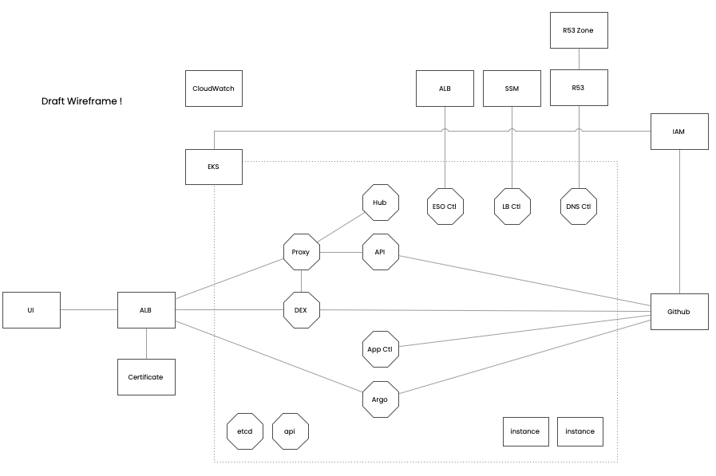

# Introductory Material
## Introduction
Diego is an integrated platform which streamlines the software development process for easier management of cloud infrastructure and application deployments. It reduces cycle times for delivering change to production. 

Diego extends the standard Kubernetes API with custom resources that model applications, environments and application versions which are realised as deployed applications running in your cluster by the Diego control plane. Diego operates based on the principles of GitOps and integrates with your organisation's GitHub to install and maintain itself and also to manage the definition of your applications, environments and deployments. Diego uses a number of AWS services to operate including EKS, IAM, Route53, Cloudwatch, ALB and SSM.

Once installed, Diego enables a number of applicaiton development use cases:

- Creation of new Diego enabled applications
- Management or onboarding of existing applications to Diego
- Automatic creation and tear down of ephemeral preview environments for a Diego enabled application
- Selective deployment of Diego enabled application versions to staging and production environments
- Flexible configuration of preview environment dependencies for the application under test
- Management and retrieval of application secrets

### Deployment Overview

Diego is typically installed into a single-region, multi-AZ EKS cluster that you have provisioned. Your deployed applications run in the same cluster, using Kubernetes namespaces to maintain isolation from Diego.

#### EKS Deployments
In addition to extending the Kubernetes API, Diego is composed of a number of integrated components deployed into your cluster.

| Deployment | Purpose     |
| ----------- | ----------- |
| Diego Application Controller | The Diego control plan manging Diego applications, environments and versions |
| Diego Hub | The Diego UI |
| Diego API | Used by the Diego UI |
| OAuth2 Proxy | Authentication gateway for the Diego UI and API |
| ArgoCD | Application deployment controller |
| Dex | OIDC proxy for your organisations identity provider |
| AWS Load Balancer Controller | Ingress controller for Diego components and your Diego enabled applications |
| DNS Controller | DNS management for Diego components and your Diego enabled applications |
| External Secrets Operator | Creates K8s secrets for you applications based on a backing store of secrets such as SSM Parameter Store |
| Cert Manager Controller | tbd |

#### AWS Services and Resources
After installation the following AWS resources will have been created or configured in your AWS account.

| Service     | Description |
| ----------- | ----------- |
| IAM Roles & Policies | Roles and policies for use by Diego installed controllers, operators and deployments. Accessed via IAM roles for service accounts (IRSA) |
| IAM OIDC Providers   | For AWS STS to validate OIDC tokens presented on role assumption from EKS service accounts as part of IRSA and same for GitHub workflows running in your Diego enabled application repos in your GitHub organisation |
| Route53 Hosted Zone | A subdomain of your organisation's domain where DNS records for your Diego enabled applications are created and managed |
| ACM Certificate | A wildcard certificate for your Diego subdomain. Used by AWS ALB for TLS based ingress to your Diego enabled applications |
| Application Load Balancer | Manages listeners on the Diego ALB for all ingress to public facing Diego components and your Diego enabled applications  |
| AWS Systems Manager Parameter Store | Used to store secrets for your Diego enabled applications |

#### GitHub Application and Repositories

Diego installation creates the following resources in your GitHub organisation.

| Resource | Purpose |
| ----------- | ----------- |
| Diego GitHub Application | Used during Diego installation and then during normal operation by the Diego API and Diego Application Controller to create and manage repositories in your GitHub organisation |
| Diego Tooling Repo | Declaration of your deployed Diego installation, created at installation time | 
| Diego Default Project Repo | Declaration of your application environments, created at installation time and managed by the Diego control plane | 

## Prerequisites and Requirements
Before starting the Diego deployment please ensure the following pre-requisites are in place.

### Technical
1. An AWS Account and access to a user or role with administrator privileges on that account.
1. A freshly provisioned EKS instance with public endpoint access enabled in the AWS account.

    - v1.24 or newer
    - Your EKS instance should be provisioned to meet the prerequisites defined in the AWS EKS documentation for [setting up an EKS cluster](https://docs.aws.amazon.com/eks/latest/userguide/create-cluster.html)

1. A single EKS managed node group in that cluster containing at least 1 x t3.large EC2 instance.
1. The VPC subnets containing the EKS managed nodes must be tagged as below. This is to support discovery by the AWS Load Balancer Controller.

    | Tag Key | Tag Value |
    |---|---|
    |kubernetes.io/role/elb|1|

1. A GitHub organisation and access to a user with administrator privileges on that organisation.
1. A domain you own and can manage, under which you can host sub-domains containing Diego installed components and also your Diego managed environments and applications. For example, if `acme.com` is your organisation's domain then

    | Domain | Purpose | Example |
    |---|---|---|
    | acme.com | Managed by you in your domain host e.g. GoDaddy | |
    | diego.acme.com | Contains Diego components | hub.diego.acme.com |
    | staging.acme.com | Contains Diego enabled applications that are deployed to the staging environment | myapp.staging.diego.com |

1. Locally installed tools to support the installation process.

    | Tool | Version | Notes |
    |---|---|---|
    | [Helm](https://helm.sh/docs/intro/install) | v3 | required |    
    | [kubectl](https://kubernetes.io/docs/tasks/tools/install-kubectl-macos/) | matching your EKS version | required | 
    | [aws-vault](https://github.com/99designs/aws-vault) | any | optional* |

    - aws-vault is used to set AWS security credentials for use by the Diego CLI installation commands.
    
### Skills and Specialised Knowledge
- A reasonable level of experience and understanding of AWS IAM, EKS, Kubectl, Github and basic command line skills (to run CLI commands) is required to complete the deployment of Diego into your AWS account.

### Specific Configuration

## Architecture
