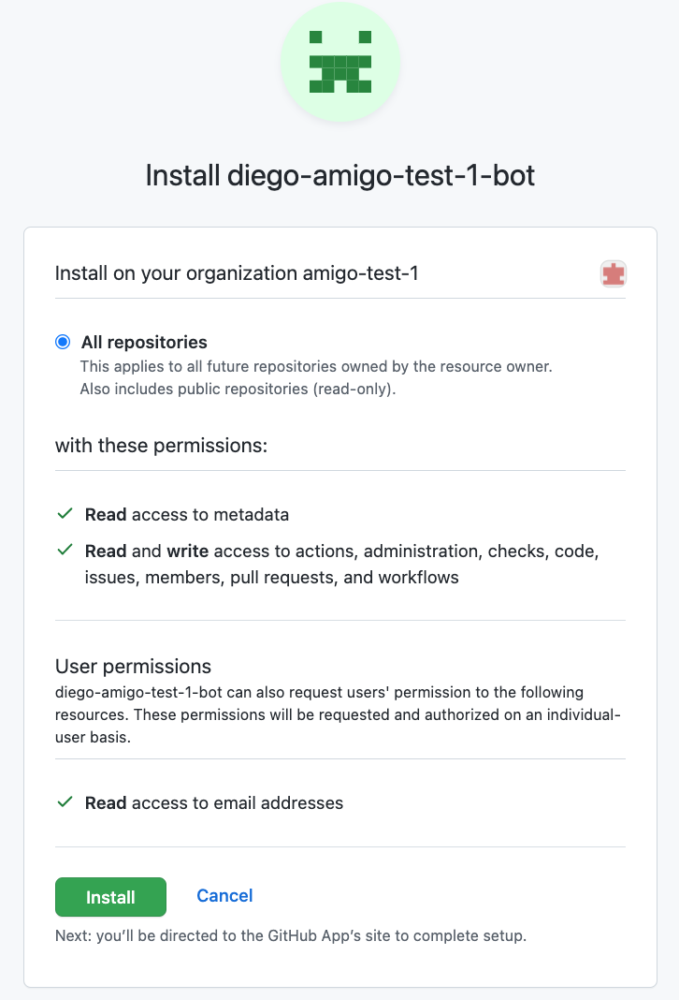

1. `diego init github`

 Estimated time: 2 minutes?

> Installs a Github app; a bot which sets up permissions to help implement GitOps by enabling communication between Github and ArgoCD

Command will request for:

- Github Organization Name

- Domain Name

Executing the diego command will prompt you to add a Github app to your organisation named `diego-<your Github Org name>-bot`

After this, you will be prompted to install the bot for your organisation. 

