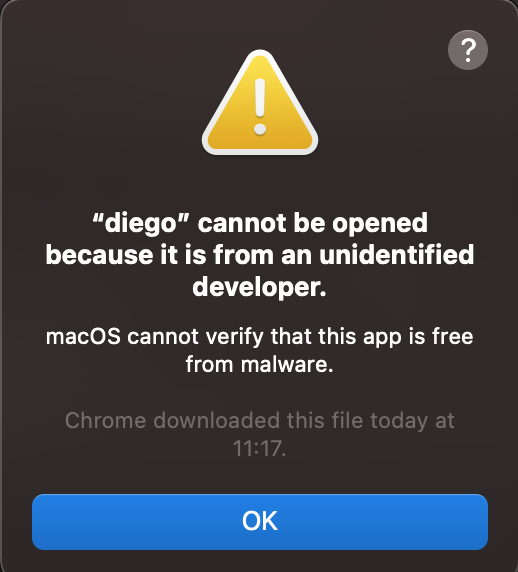
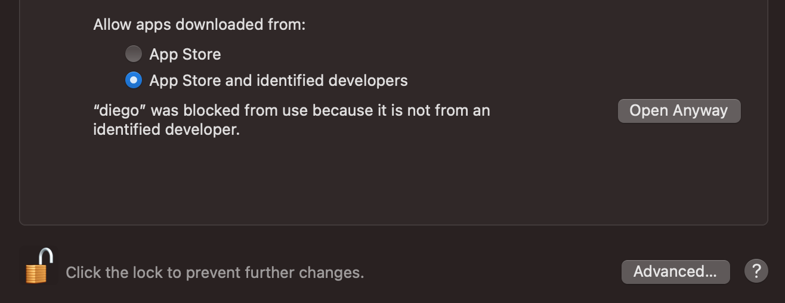

# Frequently Asked Questions ( FAQS )

## How do I ensure I install the correct archive for Diego-CLI?

The [compressed archives for Diego CLI](https://cli.diegocloud.io/) specify a number of files for each version. These specify the `<architecture>` followed by `<processor type>`. 

- `Mac`: Use `darwin` architecture. Run `uname -a` in the command line. This may flag e.g. `Darwin TAA0001.local 21.5.0 Darwin Kernel Version 21.5.0: Tue Apr 26 21:08:22 PDT 2022; root:xnu-8020.121.3~4/RELEASE_X86_64 x86_64` indicating requirement to use `darwin-x84_64.tar.gz`.

- `Linux`: Run `lscpu`. This may flag e.g. `Architecture:          x86_64`, indicating requirement to use `linux-x86_64.tar.gz`.

- `Windows`: In the command line try: `systeminfo | findstr /I type:`. This may flag e.g. `System type:               X86-based PC`, indicating requirement to use `windows-x86_64.zip`. On a Windows 10 machine, your PC will also list a `Device specification` under `About`. You will see the System type for your devices. 

## How do verify Diego CLI install on Mac?

Once you've downloaded the archive for Diego CLI on your mac, you may see the following warning: `diego cannot be opened because it is from an unidentified developer`:

In order to verify this, please go to `System Preferences`, then `Security & Privacy`. Under the first general tab, you should see the following:

Click the bottom-left corner to unclick the lock and enter your password so you can proceed to make changes to select `Open Anyway` to unblock using Diego.

## How do I set Diego CLI to my path on mac?

- Copy the path to the executable for diego and run:
`sudo nano /etc/paths`
- Add the path to the file. 
- Try `diego --version` to test you have added it to path.

## How do I overcome 'Unauthorized' error with Diego CLI command diego setup aws?

When you run `diego setup aws` you may encounter the following error:

`Error: error: You must be logged in to server (Unauthorized).`

In this case, please ensure you execute this command using `aws-vault` to set the aws context e.g.

`aws-vault exec <your profile> -- diego setup aws`

## How do I overcome 'INSTALLATION FAILED' error with Diego CLI command diego install diego-core?

`Error: INSTALLATION FAILED: Kubernetes cluster unreachable: the server has asked for the client to provide credentials`

In this case, please ensure you execute this command using `aws-vault` to set the aws context e.g.

`aws-vault exec <your profile> -- diego install diego-core`